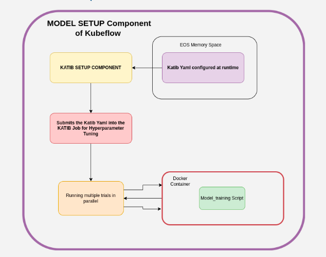

## Katib 
>Katib is a hyperparameter tuning framework that comes with Kubeflow. It provides scalability through k8s environment as it 
> can run multiple trials in parallel. Katib is a host of various powerful algorithms that can be added in our workflow 
> such as **NAS**, **Bayesian Optimisation**,**Grid Search**,etc. The Katib experiments are parallely run on GPUs
> and would strongly depend on the resource allocated to your namespace
>

### How to run Katib experiments from Kubeflow Dashboards
- Open the Kubeflow Dashboard at ml.cern.ch
- Go the **AutoML Experiments** tab on the left hand of the screen
- Click on `+ New Experiment`
- Go to the lower part of the screen and click on `Edit and submit YAML`
- Paste your YAML and submit it
- The Katib Experiments will soon be visible on the AutoML Experiments

### Understanding Katib YAML
For this section we are going to use the Katib YAML from [here](https://gitlab.cern.ch/gkohli/geant4-kubeflow-pipeline/-/blob/master/katib.yaml)
as a reference. 


- `metadata`: Includes the name of the experiment and the namespace where it will run
- `spec`: Defines the Specifications of the Katib Experiment which is to be created. It includes:
  - `Objective`: objectiveMetricName you want to tune. Do you want to maximize/minimize it ? What is the goal value which would confirm the success of the experiment
  - `algorithm`: Which algo to use for Hyperparameter Tuning
  - `TrialCounts`: Defining the number of experiments you want to run. 
    - `parameters`: Specifying the parameters you want to tune
      - `name`: Name of the Parameter
      - `parameterType`: Datatype 
      - `feasibleSpace`: Range in from which you want to select the parameter
- `trialSpec`: Defines the specification of the 
  - `spec`: Define a specs for the container where the dockerized training setup will be pulled into the container and run in the form of Katib Experiment
  - `resources`: Define the resources to be allocated to the container
  - `image` : Docker image of the training setup
  - `command`: Commands to run the model training script from inside the docker

> For indepth understanding of Katib YAML visit the [official documentation](https://www.kubeflow.org/docs/components/katib/trial-template/)

### Creating Docker Images of Model Training
Dockerizing the components is an essential step in Kubeflow Pipeline construction 
This helps in setting up different environments and resources for each component of a pipeline
It is also necessary if we want KATIB to attach with our model training setup since KATIB runs this image multiple times in parallel
Following steps would help in creating a custom image for a component
>Note:Use of VS Code for Docker Related Workflow is suggested

`STEP1`: Open VS Code and add your training script

`STEP2`: Get the `krb5.conf` file from the [repo](https://gitlab.cern.ch/gkohli/geant4-kubeflow-pipeline/-/blob/master/training_docker/krb5.conf)

`STEP3`: Refactor the training script to accept arguments through args parser

> For reference our Dockerized Model Setup and Training can be found [here](https://gitlab.cern.ch/gkohli/geant4-kubeflow-pipeline/-/blob/master/training_docker/main.py)

`STEP4`: Create a Dockerfile

`STEP5`: In the Dockerfile define the Base Image, set up the krb configuration for EOS access, add the command to run the training script and pip install the requirements 

> Note: krb configuration inside Dockerfile looks as follows:
> ```commandline
> ENV DEBIAN_FRONTEND=noninteractive
> RUN apt-get -qq update && \
>    apt-get -yqq install libpam-krb5
 krb5-user && \
>    apt-get -yqq clean && \
>    apt-get install -y --no-install-recommends \
>        ca-certificates bash-completion tar less \
>        python3-pip python-setuptools build-essential python-dev \
>        python3-wheel && \
>    rm -rf /var/lib/apt/lists/*
> COPY krb5.conf /etc/krb5.conf

`STEP6`: Once the files are in place open Terminal

`STEP7`: Run `sudo chmod 666 /var/run/docker.sock`

`STEP8`: Run `docker login gitlab-registry.cern.ch` and enter your credentials

`STEP9`: Run `docker build . -f Dockerfile -t <your_repo_name>:<image_tag>`

`STEP10`: Run `docker push <your_repo_name>:<image_tag>`

`STEP11`: Your script is now Dockerized and can be found in the gitlab registry under your repo


### Integrating Katib into Kubeflow Pipeline



The Image above explains the Setup of Katib when we want to execute it from inside our Kubeflow Pipeline.
Katib and the pipeline we runs on different pods. To establish a communication the KATIB Pod is initiated from inside the 
Kubeflow Pipeline. The Component waits for Katib to complete its execution and yield the best model.
The Best model is then extracted and passed onto the further components of the pipeline.
To understand the execution please checkout the preparation of a KATIB Component from inside a Kubeflow Pipeline [here](https://gitlab.cern.ch/gkohli/geant4-kubeflow-pipeline/-/blob/master/pipeline_components/katib_setup.py).

#### Features of the created Katib Setup
- Automatically submits the YAML file to the Kubeflow Dashboard and create the KATIB Pods without user interference
- The code refactors the KATIB Template created during runtime and thus provides smoother execution of the pipeline
- Selects the Best model from all the experiments and delete the remaining model checkpoints
